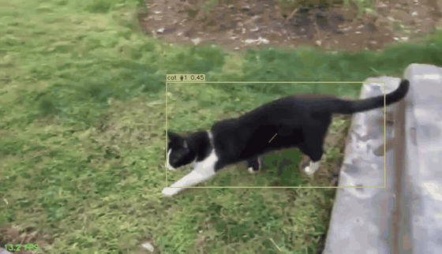
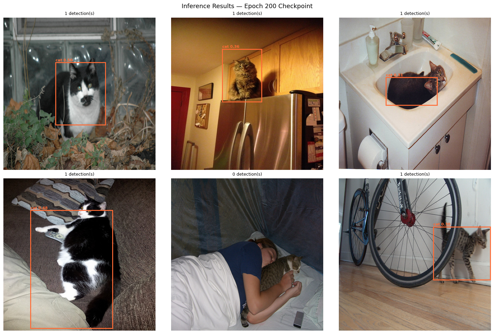
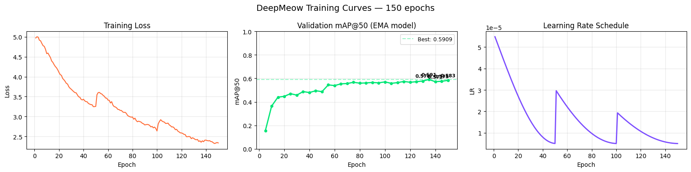

# DeepMeow: Real-Time Cat Detection & Multi-Object Tracking

[](https://colab.research.google.com/github/IliyaJz/DeepMeow/blob/main/notebooks/DeepMeow_Colab.ipynb)


A research-focused computer vision implementation in PyTorch. The goal of this project is to build a single-shot object detector and multi-object tracker **from first principles** (without relying on high-level prebuilt frameworks like `ultralytics/yolov8`), making every component fully interpretable and extensible — down to the Kalman filter, the Hungarian algorithm and the mAP evaluator.

---

## Demo — Tracked Video

End-to-end pipeline (detector → DeepSORT tracker → renderer) running on a real 219-frame 1280×736 cat clip, with persistent track IDs, confidence labels and motion trails. Click the preview to watch the full-quality MP4.

[](assets/tracked_demo.mp4)

*Tracked demo — `results/tracked_demo.mp4` reproduced from notebook §34 (Colab Tesla T4, `best.pt` checkpoint, EMA weights).*

---

## Qualitative Detection Results

Inference on 6 random validation images (confidence threshold 0.3, NMS IoU 0.45) using the epoch-200 checkpoint:



*Notebook §21 — 5/6 images produce a correct, tightly-fitted detection (scores 0.30–0.61). The one miss (bottom-center) is a severely occluded cat curled against a sleeping person in a dark scene — a known hard case for the model (see [Limitations](#-limitations)).*

---

## Project Motivation & Scope

While off-the-shelf detection APIs exist, building a multi-scale object detector from scratch provides deep insights into:
- Feature extraction dynamics across receptive fields
- Anchor-based target encoding and multi-task loss design (CIoU + Focal Loss)
- Motion estimation via Kalman filtering and state association via the Hungarian algorithm

We focus on single-class detection and tracking ("cat") using annotated images from the COCO 2017 dataset for training and custom video feeds for tracking evaluation.

---

## Results & Evaluation

### Detection accuracy (COCO-style mAP)

| Item | Value |
|---|---|
| Dataset | COCO 2017 filtered to `cat` — **3,000 train / 184 val** images (3,444 GT boxes) |
| Model | `DeepMeowDetector` — **49,913,366 trainable parameters**, input 416×416 |
| Training | 200 epochs (multi-session), AdamW, LR 1e-4, batch 8, 3-epoch warmup + cosine annealing with per-session restarts, gradient clipping |
| Stabilizers | EMA (decay 0.9999, step 56,250), 4-image Mosaic + Mixup, K-Means anchors (mean best-IoU **0.7435**) |
| **Best mAP@50** | **0.5909** (EMA weights, epoch 135) |
| Final mAP@50 | 0.5831 (epoch 200) |



*Notebook §26 — loss, validation mAP@50 (evaluated on EMA weights) and the multi-session cosine LR schedule. Validation runs every 5 epochs; the curve is still inching upward at the 200-epoch cutoff, suggesting more training or more data would help.*

**Reading the numbers.** A from-scratch detector at ~0.59 mAP@50 on a single class is respectable but not production-grade — roughly on par with early YOLOv3-era single-class baselines under similar data/epoch budgets, and achieved with zero pre-trained weights. The gap to modern one-stage detectors comes from the smaller dataset (3k images), the 416×416 input resolution, and no backbone pre-training.

### Tracker verification (synthetic, deterministic tests)

Every tracking component ships with from-scratch sanity tests (notebook §30–33), all passing:

| Component | Test | Result |
|---|---|---|
| Kalman filter | Constant-velocity trajectory in noise | Raw detection error **4.24 px → 2.14 px** filtered; covariance trace 200.2 → 14.5 |
| Kalman gating | Mahalanobis χ²(95%, dof=4) gate 9.4877 | Consistent detection d²=0.01 → accept; impostor 500 px away d²=33,430 → reject |
| Hungarian algorithm | 50 random matrices vs brute force | **50/50 optimal** |
| Hungarian algorithm | Cross-check vs `scipy.optimize.linear_sum_assignment` | **20/20 identical totals** |
| SORT | Cat occluded for 5 frames | Same track ID re-acquired at frame 27 (≤ tolerance) |
| SORT | Two parallel cats | Two stable IDs, **zero switches** |
| DeepSORT | Two cats crossing paths, detection order shuffled every frame | Both identities preserved through the crossover |
| DeepSORT | Appearance extractor | 128-D unit-norm embeddings, 1,012,128 params |

### Inference speed (Tesla T4, 1280×736 input frame, 416×416 network input)

| Variant | Latency | Throughput |
|---|---|---|
| Baseline (eager fp32) | 36.14 ms | 27.7 FPS |
| TorchScript-traced fp32 | 31.23 ms | 32.0 FPS |
| **TorchScript-traced fp16** | **16.12 ms** | **62.0 FPS** |

- **Equivalence contract verified**: the fp32 fast path reproduces the baseline's boxes exactly (`assert` in notebook §37) — optimization changes speed, not detections.
- **End-to-end video** (219 frames, incl. video I/O + rendering): 19.4 FPS (demo CLI) → **24.6 FPS** with the optimized fp16 pipeline (35–38 FPS on the decode/detect path).
- **Profiler**: cuDNN convolutions dominate the fast path (~83% of CUDA self-time) — the remaining headroom is in the conv stack, not the decode/NMS logic, which the fused decode already reduced to a single GPU pass.
- Optimizations applied: TorchScript tracing, FP16 tensor cores, one-time anchor caching (was 10,647 rows rebuilt per frame on CPU), fused multi-scale decode, pre-allocated CUDA input buffer.

---

## Repository Structure

Here is how the codebase is organized so you can easily follow along with the modular pipeline:

```
DeepMeow/
├── notebooks/
│   └── DeepMeow_Colab.ipynb   # Interactive execution notebook (GPU recommended)
├── assets/                    # README media (demo GIF, result grids, curves)
├── data/                      # Dataset root (git-ignored, generated at runtime)
│   ├── raw/                   # COCO cat images (train/val splits)
│   └── annotations/           # Filtered COCO JSON annotations
├── src/
│   ├── train.py               # Training loop (warmup, cosine, EMA, checkpoints)
│   ├── inference.py           # CatDetectorTracker: streaming + batch video pipeline
│   ├── optimize.py            # TorchScript/FP16 fast path + benchmark & equivalence
│   ├── data/
│   │   ├── downloader.py      # Automated COCO filtering & streaming downloader
│   │   ├── dataset.py         # PyTorch Dataset implementation
│   │   ├── augmentations.py   # Albumentations pipeline (Spatial + BBox transforms)
│   │   ├── mosaic.py          # 4-image Mosaic and Mixup data augmentation
│   │   └── clips.py           # Demo clip resolver (Drive / YouTube / synthetic)
│   ├── models/
│   │   ├── backbone.py        # Custom ResNet-style CNN feature extractor (P3, P4, P5)
│   │   ├── neck.py            # Feature Pyramid Network (FPN) — top-down feature fusion
│   │   ├── head.py            # Multi-scale anchor-based detection head
│   │   └── detector.py        # End-to-end detector (Backbone -> FPN -> Head)
│   ├── losses/
│   │   └── detection_loss.py  # CIoU box loss + Focal objectness + BCE classification
│   ├── utils/
│   │   ├── boxes.py           # IoU, CIoU, NMS, anchor generation, box encode/decode
│   │   ├── metrics.py         # COCO-style mAP evaluation (mAP@50 & mAP@50:95)
│   │   ├── ema.py             # ModelEMA (Exponential Moving Average) weight smoothing
│   │   └── kmeans_anchors.py  # 1-IoU K-Means anchor clustering for custom datasets
│   └── tracking/              # Multi-object tracking engine
│       ├── kalman_filter.py   # 8-D constant-velocity Kalman filter + Mahalanobis gating
│       ├── hungarian.py       # From-scratch O(n²m) Hungarian assignment algorithm
│       ├── sort.py            # SORT: Kalman predict → IoU cost → Hungarian → lifecycle
│       ├── deep_sort.py       # DeepSORT: appearance CNN (128-D) + cascaded matching
│       └── demo.py            # End-to-end video demo (detector + tracker + trails)
├── configs/
│   └── default.yaml           # Central hyperparameter configuration (incl. tracking)
└── requirements.txt           # Environment dependencies
```

---

## 6-Week Development Roadmap

- [x] **Week 1: Data Pipeline & Custom CNN Backbone**
  - Configured project directory structure & YAML hyperparameter definitions
  - Implemented automated dataset downloader filtering COCO 2017 for cat annotations (~3,000 train / ~500 val images)
  - Built custom PyTorch `Dataset` & Albumentations bbox transform wrapper
  - Built ResNet-style CNN backbone producing multi-scale feature maps ($P_3$, $P_4$, $P_5$) — ~40.5M parameters

- [x] **Week 2: Feature Pyramid Network (FPN), Detection Head & Loss Functions**
  - Implemented FPN top-down pathway with lateral connections, fusing backbone maps into uniform 256-channel outputs
  - Designed anchor-based `MultiScaleHead` producing 6 values per anchor (4 offsets + objectness + class)
  - Implemented anchor-GT matching with IoU thresholds (positive >= 0.5, ignore 0.4–0.5, negative < 0.4)
  - Implemented Complete IoU (CIoU) box regression loss and Focal Loss for objectness imbalance
  - Assembled the full `DeepMeowDetector` with training and NMS-based inference modes

- [x] **Week 3: Training Pipeline & Advanced Augmentation**
  - Implemented AdamW optimizer with linear warmup + Cosine Annealing LR schedule
  - Integrated 4-image Mosaic and Mixup data augmentation strategies
  - Implemented COCO-style mAP evaluation (mAP@50 and mAP@50:95 with 11-point interpolation)
  - Built full training loop with gradient clipping, periodic checkpointing, and best-model saving

- [x] **Week 4: Optimization, Hyperparameter Tuning & Scaling Up**
  - Implemented K-Means anchor clustering using $1 - \text{IoU}$ distance metric to compute optimal anchor sizes for cat shapes
  - Built `ModelEMA` (Exponential Moving Average) with warm-up ramp-up decay and checkpoint state persistence
  - Updated validation to evaluate on smoothed EMA weights for enhanced stability and mAP gains
  - Built multi-session training workflow with LR schedule position recovery and cosine floor ($\eta_{\text{min}}$) for Google Colab

- [x] **Week 5: Multi-Object Tracking Engine (SORT / DeepSORT)**
  - Implemented an 8-D constant-velocity Kalman filter from scratch (NumPy): state $[c_x, c_y, w, h, \dot{c_x}, \dot{c_y}, \dot{w}, \dot{h}]$, predict/update cycles, and squared-Mahalanobis gating with the $\chi^2$ (95%, dof=4) threshold
  - Implemented the Hungarian assignment algorithm from scratch ($O(n^2 m)$ shortest-augmenting-path variant with dual potentials) — verified optimal against brute force and `scipy.optimize.linear_sum_assignment` on random matrices
  - Built the SORT tracker: per-frame Kalman prediction → IoU cost matrix ($1 - \mathrm{IoU}$) → Hungarian matching → track lifecycle (`max_age` occlusion tolerance, `min_hits` confirmation)
  - Built a lightweight appearance extractor (~1M params, ResNet-flavored CNN → global average pool → 128-D L2-normalized embedding) for detection crops
  - Implemented DeepSORT cascaded matching: appearance stage combining cosine gallery distance (min over last K=100 views) with Mahalanobis motion cost, $d = \lambda \, d_{\text{Mahalanobis}} + (1-\lambda)\, d_{\text{cosine}}$, double-gated by $\chi^2$ + cosine thresholds; IoU fallback stage for leftovers
  - Sanity tests: constant-velocity trajectory recovery through detector dropouts, crossing-cats identity preservation under shuffled detection order, gallery budget trimming
  - Added `src/tracking/demo.py`: end-to-end video pipeline rendering boxes, persistent IDs, confidence labels and motion trails

- [x] **Week 6: Inference Pipeline, Profiling & Portfolio Documentation**
  - Wrapped detector + tracker into a reusable `CatDetectorTracker` (`src/inference.py`) with streaming `step()` API, live confidence slider and per-video summary stats
  - Built the optimized fast path (`src/optimize.py`): TorchScript trace + FP16 + cached anchors + fused decode — **2.2× speedup (27.7 → 62.0 FPS)** with bit-identical fp32 boxes
  - Benchmarked FPS end-to-end and profiled the fast path (cuDNN convolutions dominate)
  - Portfolio documentation with reproduced results (this README)

---

## Current Architecture Overview

The detection pipeline flows as follows:

```
Input Image [B, 3, 416, 416]
        |
   [Backbone]   <- custom ResNet-style CNN
        |
  P3 [B, 256,  52, 52]   <- stride 8  (small objects)
  P4 [B, 512,  26, 26]   <- stride 16 (medium objects)
  P5 [B, 1024, 13, 13]   <- stride 32 (large objects)
        |
    [FPN Neck]  <- top-down lateral feature fusion
        |
  F3 [B, 256, 52, 52]
  F4 [B, 256, 26, 26]
  F5 [B, 256, 13, 13]
        |
 [Detection Head]  <- separate head per scale
        |
  pred3 [B, 52, 52, 3, 6]   <- 3 anchors, 6 values each
  pred4 [B, 26, 26, 3, 6]
  pred5 [B, 13, 13, 3, 6]
        |
  [Loss / NMS]  <- training vs inference
```

Total predictions per image: 52x52x3 + 26x26x3 + 13x13x3 = **10,647 anchors**

---

## Tracking Engine Overview

Detections are streamed into a multi-object tracker that maintains persistent cat identities across frames:

```
Frame t detections [N, 4]          Existing tracks {Kalman state}
            \                            |
             ▼                           ▼
      ┌─────────────────────────────────────────┐
      │ 1. PREDICT — Kalman filter advances     │
      │    every track one frame ahead          │
      │    x' = Fx,   P' = FPFᵀ + Q             │
      ├─────────────────────────────────────────┤
      │ 2. ASSOCIATE (cascaded, DeepSORT)       │
      │    a. appearance:                       │
      │       d = λ·d_mahalanobis               │
      │         + (1−λ)·d_cosine(gallery)       │
      │       gated by χ²(9.49) & cosine ≤ 0.25 │
      │    b. fallback: IoU ≥ threshold         │
      │       both solved via Hungarian alg.    │
      ├─────────────────────────────────────────┤
      │ 3. UPDATE                               │
      │    matched    → Kalman correction +     │
      │                 gallery.append(embed)   │
      │    unmatched det → new track            │
      │    unmatched trk → coast (≤ max_age)    │
      └─────────────────────────────────────────┘
             |
             ▼
   Tracked outputs: [{id, box, score, trail}]
```

**Key components:**

| Module | What it does | Built from scratch? |
|--------|--------------|---------------------|
| `tracking/kalman_filter.py` | Constant-velocity motion model; smooths jittery detections and coasts through occlusions | Yes (NumPy linear algebra) |
| `tracking/hungarian.py` | Optimal detection↔track assignment on cost matrices | Yes ($O(n^2m)$ augmenting-path variant) |
| `tracking/sort.py` | Track lifecycle: prediction, IoU association, spawn/confirm/delete | Yes |
| `tracking/deep_sort.py` | Appearance embeddings + cascaded matching to prevent ID switches at crossings | Yes (~1M-param CNN + matching logic) |

The tracker tolerates detector dropouts up to `max_age=30` frames (~1 s), suppresses false positives with `min_hits=3`, and keeps identities stable when cats cross paths by comparing each detection's 128-D crop embedding against every stored view of a track.

---

## Running the Pipeline (Google Colab)

To replicate our experiments without setting up a local GPU environment:

1. Click the **Open in Colab** badge at the top of this page.
2. Ensure GPU acceleration is enabled (`Runtime -> Change runtime type -> T4 GPU`).
3. Execute the cells in `notebooks/DeepMeow_Colab.ipynb` sequentially:
   - **§1–8**: environment setup, dataset download, backbone verification
   - **§9–15**: FPN, head, loss, and full detector verification
   - **§16–22**: mAP evaluator, mosaic augmentation, training & inference grid
   - **§23–28**: K-Means anchors, EMA verification, multi-session training, debug checklist
   - **§30–35**: Kalman / Hungarian / SORT / DeepSORT verification + tracked video demo
   - **§36–37**: reusable inference pipeline, FP16/TorchScript optimization & benchmarks

If you prefer running locally:
```bash
git clone https://github.com/IliyaJz/DeepMeow.git
cd DeepMeow
pip install -r requirements.txt
python src/data/downloader.py
```

### Verifying the Tracking Engine

Each tracking module ships with a standalone sanity-test block that runs without any data or GPU:

```bash
python src/tracking/kalman_filter.py   # trajectory recovery + Mahalanobis gating tests
python src/tracking/hungarian.py       # brute-force + scipy optimality cross-checks
python src/tracking/sort.py            # occlusion persistence + two-cat ID separation
python src/tracking/deep_sort.py       # extractor shapes + crossing-cats identity test
```

Once a detector checkpoint exists, produce a tracked demo video:

```bash
python src/tracking/demo.py \
    --video path/to/cats.mp4 \
    --checkpoint checkpoints/best.pth \
    --out results/tracked_demo.mp4
```

Or use the reusable pipeline programmatically:

```python
from src.inference import CatDetectorTracker

pipeline = CatDetectorTracker(checkpoint="checkpoints/best.pt", conf_threshold=0.25)
summary = pipeline.run_video("cats.mp4", "tracked.mp4")   # {'frames':…, 'fps':…, 'peak_tracks':…}

outputs, canvas = pipeline.step(frame)   # streaming / webcam use
pipeline.conf_threshold = 0.40           # live "slider", no rebuild needed
```

---

## Limitations

- **mAP@50 ≈ 0.59** — solid for a from-scratch model on 3k images, but below modern pre-trained detectors; the biggest wins left on the table are backbone pre-training, larger input resolution and more data.
- **Low-confidence misses** — heavily occluded cats in dark scenes can fall under the 0.3 confidence threshold (see the 6-image grid above).
- **Appearance embeddings are trained from scratch** on detection crops only; a metric-learned Re-ID embedding would further harden identity preservation.
- Single class (`cat`) by design; extending to multi-class requires only head/config changes.
